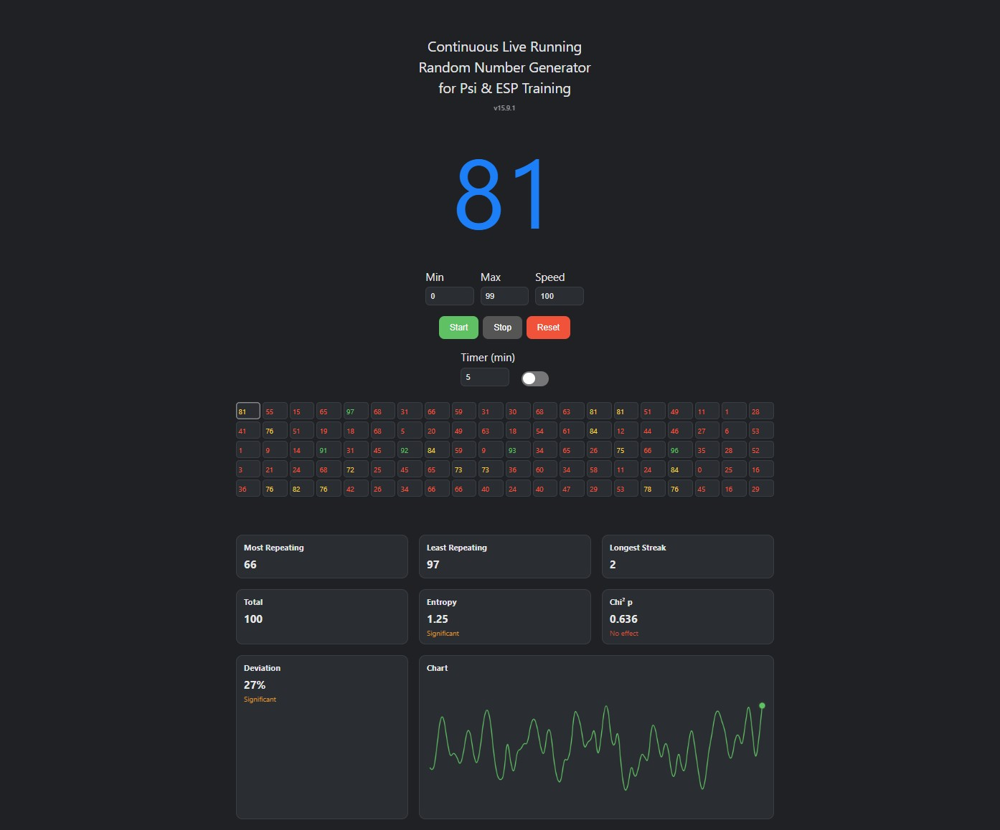
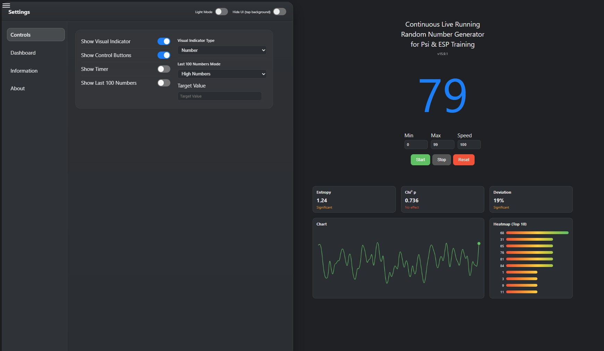
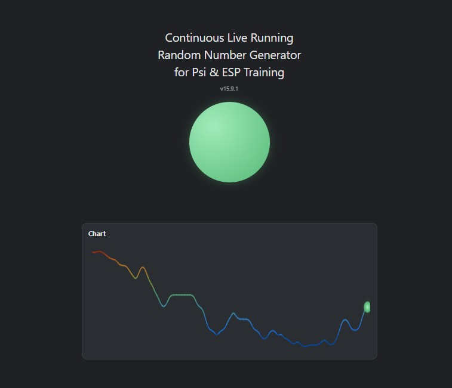

# Continuous Live Running Random Number Generator for Psi & ESP Training

🌐 Find the Generator here: https://gold3nboyy.github.io/Live_RNG_PSI_Training

This generator produces a continuous stream of random numbers based on your chosen range and speed. You can start or stop it at any moment, and the newest number always appears on the left side of the history. It doesn’t use seeds, so it never starts from a fixed point or repeats a pattern. Instead, it uses the device’s hardware to create randomness fresh every time — like rolling a real dice inside the phone or computer. That’s why the numbers can’t be predicted and don’t follow any hidden formula..

### Background and Research
This project is inspired by decades of research into mind–matter interaction and random systems. Experiments at the PEAR Lab (Princeton Engineering Anomalies Research), SRI International, and later remote-viewing programs investigated whether focused intention or perception could produce small but measurable deviations in random number generators and other physical systems. The reported effects were subtle and not presented as definitive proof, but they showed statistical patterns that were difficult to explain by chance alone.

### Disclaimer
This generator does not claim to demonstrate or prove any paranormal ability. Instead, it offers a simple, transparent way for you to explore these ideas yourself: by watching how the number flow behaves during periods of focused attention, intention, or PSI training, and deciding what—if anything—you make of the patterns you see. I'm just some guy vibe coding. This is a work in progress. It's not really optimized for mobile use, that part is giving me a hard time. So my focus right now is regular use on pc.

## Generator

## Settings

## Local Consciousness Dot

If you're interested to check out the code or work with it feel free to use it.
📦 Download Code: Go to Green „Code“-Button → „Download ZIP“ 
(It's all in one HTML file and includes HTML, CSS and JavaScript)

